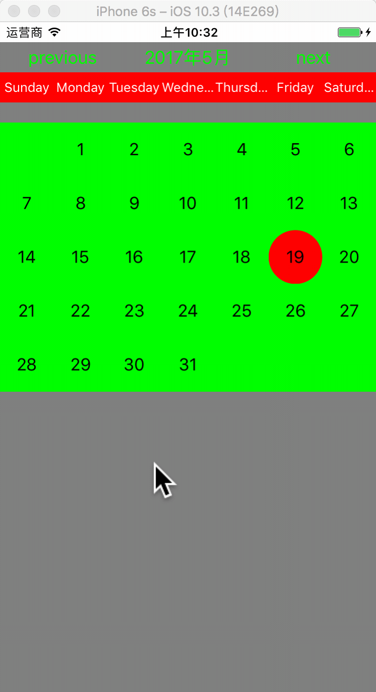
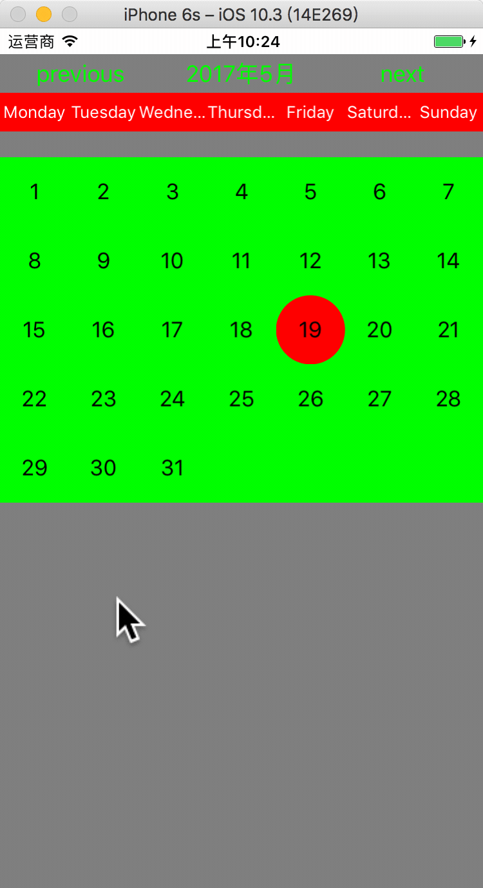

# Calendar
简单的日历实现
#### 获取日历一周索引值

```
    NSCalendar *calendar = [NSCalendar currentCalendar]; // 
    NSLog(@"FirstWeekday = %ld",calendar.firstWeekday);//默认值 是 1。
    [calendar setFirstWeekday:1]; //  设定日历每周的第一天从星期几开始，比如:如需设定从星期日开始（“开始”意味着日历的第一天（索引为1）对应的是星期天），则value传入1 ，如需设定从星期一开始，则value传入2 ，以此类推。
    
    
    // 这里到天day和hour
    NSDateComponents *comp = [calendar components:NSCalendarUnitYear | NSCalendarUnitMonth | NSCalendarUnitDay | NSCalendarUnitHour fromDate:date];
    NSLog(@"date = %@",date); // 2017-05-18 11:27:37 +0000
    NSLog(@"dayComponet = %ld",comp.day);// 打印结果是18
    NSLog(@"HourComponet = %ld",comp.hour);// 14H
    // 从打印结果可以看出，calendar先把date加了3个小时，再处理component
    
    // newDate
    NSDate *newDate = [calendar dateFromComponents:comp];
    NSLog(@"newDate = %@", newDate);// 2017-05-18 11:00:00 +0000 ,也就是说从calendar取出来的date是受NSTimeZone限制的。
    // 从打印结果分析，calendar先components取出数值，再减去3小时。
    
    // 设置为这个月的第一天
    [comp setDay:1]; // 把comp的day属性设置为一号，即comp是5月1号14H
    NSLog(@"dateComponet = %ld",comp.day);// 打印结果是1
    NSDate *firstDayOfMonthDate = [calendar dateFromComponents:comp];
    NSLog(@"firstDayOfMonthDate = %@",firstDayOfMonthDate);// 2017-05-01 11:00:00 +0000
    NSDateFormatter *fommatter = [[NSDateFormatter alloc] init];
    [fommatter setDateFormat:@"yyyy-MM-dd HH:mm:ss"];
    NSString *timeString = [fommatter stringFromDate:firstDayOfMonthDate];
    NSLog(@"timeStr = %@",timeString);// 2017-05-01 14:00:00,这里可以看出fommatter也受时区影响。
    
    // 经测试firstDayOfMonthDate 取值在2017-04-40 21:00:00 +0000 ~ 2017-05-01 21:00:00 +0000（不包括）之间，下面方法返回结果都一样，所以Calendar 受TimeZone影响，会给date自动加3小时。
    NSUInteger firstWeekday = [calendar ordinalityOfUnit:NSCalendarUnitWeekday inUnit:NSCalendarUnitWeekOfMonth forDate:firstDayOfMonthDate]; // 这个月第一天在当前日历的顺序
    // 返回某个特定时间(date)其对应的小的时间单元(smaller)在大的时间单元(larger)中的顺序位置（索引值）
    
    // 如果这里值是2，因为前面设置的周日是第一位置，所以这里的索引2，对应的应该是周一。
    NSLog(@"firstWeekday = %ld",firstWeekday);
```
> 本次代码分析的是component保留hour的情况，下面gif图是本人在第二天的运行的截图，上面代码分析是在18号。
> 


```
    NSCalendar *calendar = [NSCalendar currentCalendar];
    NSLog(@"FirstWeekday = %ld",calendar.firstWeekday);//默认值 是 1。
    [calendar setFirstWeekday:2];

    NSLog(@"date = %@",date); // 如果是5月31号21:00到6.1号21点（不包括）
    // 这里到天day
    NSDateComponents *comp = [calendar components:NSCalendarUnitYear | NSCalendarUnitMonth | NSCalendarUnitDay fromDate:date];
    NSLog(@"dateComponet = %ld",comp.day);// 打印结果是1，component 是6.1
    
    // newDate
    NSDate *newDate = [calendar dateFromComponents:comp];
    NSLog(@"newDate = %@",newDate);// 这里的结果会是5月31号 21:00:00 +0000
    
    // 设置为这个月的第一天
    [comp setDay:1]; // 把comp的day属性设置为一号，即comp是6月1号
    NSLog(@"dateComponet = %ld",comp.day);// 打印结果是1
    NSDate *firstDayOfMonthDate = [calendar dateFromComponents:comp];
    NSLog(@"date = %@",firstDayOfMonthDate);// 05-31 21:00:00 +0000
    
    // 经测试firstDayOfMonthDate 取值在2017-04-40 21:00:00 +0000 ~ 2017-05-01 21:00:00 +0000（不包括）之间，下面方法返回结果都一样。date会加3个小时，变成6月份的日历。
    NSUInteger firstWeekday = [calendar ordinalityOfUnit:NSCalendarUnitWeekday inUnit:NSCalendarUnitWeekOfMonth forDate:firstDayOfMonthDate]; // 这个月第一天在当前日历的顺序
    // 返回某个特定时间(date)其对应的小的时间单元(smaller)在大的时间单元(larger)中的顺序位置（索引值）
    
    // 这里值是1，因为前面设置的周一是第一位置，所以这里的索引1，对应的就是周一。
    NSLog(@"firstWeekday = %ld",firstWeekday);
```

> 本次代码分析的是component只保留到day的情况 。下面gif图是本人在第二天的运行的截图，上面代码分析是在18号。
> > 

> 上面两个例子都没有问题，关键是
> 
> 1. 涉及到TimeZone，对TimeZone对象的分析很关键。[NSTimeZone setDefaultTimeZone:[NSTimeZone timeZoneWithName:@"Europe/Vilnius"]]的设置没在上面代码中显示，这是欧洲东时区三区的一个设置，也可以通过单独设置日历的时区对象属性。
> 2. 第二个关键部分是：找到对应月份和当前月对应的第一天，只要确保月份没有找错（component对应的月份就是最关键的月份），逻辑上就是对的。 如果date（格林威治标准时间GMT（[NSDate date]））是5月31号21:00，component对应的数字就是6（month）和1（day），日历内部对应的“日期”就是6月1号00:00（以东三时区为例）；component设置第一天对应的相关数值也是6（month）和1（day），然后用日历转化为date就是5月31号21:00，日历内部对应的“日期”就是6月1号00:00。

> 3. 第三个关键部分是：找到第一个“日期”对应的星期数，用的时间（NSDate）可能是上个月的时间，比如：date（格林威治标准时间GMT（[NSDate date]））是5月31号21:00，然而时间对应“日期”（6月1号00:00）才是日历要查询的依据（日历会根据TimeZone自动调整date成“日期”）。

**找到日期对应月的第一天日期（更直接的方法）**
> 下面方法更直接，但是通过上面的代码，我们可以更好地分析本月第一天会是上个月的日期的情况。

```
- (NSDate *)firstDayOfCurrentMonthForDate:(NSDate *)date  {  
    NSDate *startDate = nil;  
    BOOL ok = [[NSCalendar currentCalendar] rangeOfUnit:NSMonthCalendarUnit startDate:&startDate interval:NULL forDate:date];   
    return startDate;  
} 
```
